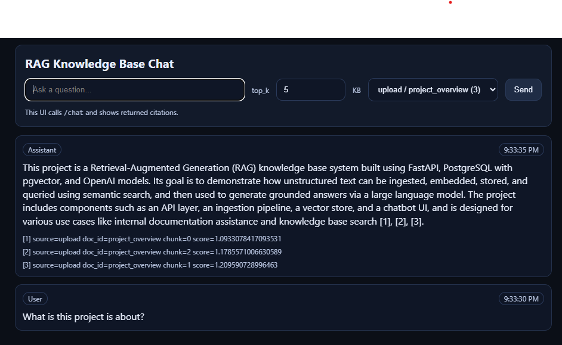
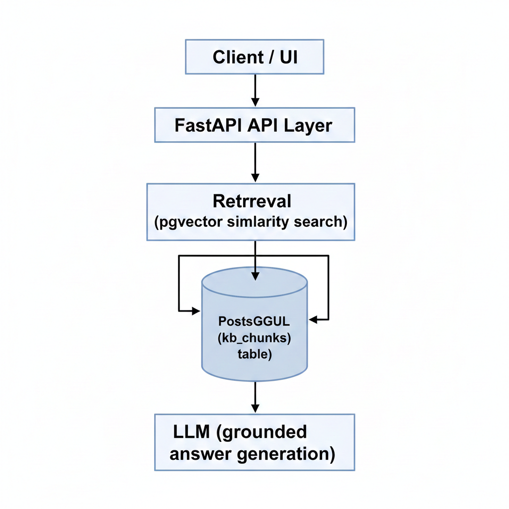

# RAG Knowledge Base (FastAPI + pgvector)

A Retrieval-Augmented Generation (RAG) knowledge base system built with **FastAPI**, **PostgreSQL + pgvector**, and **OpenAI embeddings**.  
This project demonstrates how unstructured text can be ingested, embedded, stored, retrieved via semantic search, and used to generate grounded answers with citations.



---

## ✨ Features

- 📄 Text & file ingestion (chunking with overlap)
- 🧠 OpenAI embeddings stored in PostgreSQL (pgvector)
- 🔎 Semantic vector search (top-K retrieval)
- 💬 RAG-based chat with strict grounding
- 📚 Source & citation tracking
- 🖥️ Minimal web-based chatbot UI
- 🧪 Fully testable via API & CLI

---

## 🏗️ Architecture



---

## 🚀 Running Locally

```bash
poetry install
poetry run uvicorn rag_knowledge_base_fastapi.main:app --reload
Visit:

API Docs: http://127.0.0.1:8000/docs

Chat UI: http://127.0.0.1:8000/chat.html

📌 Example Use Case

Internal documentation assistant

Knowledge base search

AI-powered helpdesk

RAG experimentation platform

🛠️ Tech Stack

FastAPI

PostgreSQL

pgvector

SQLAlchemy

OpenAI API

Poetry

⚠️ Hallucination Control

The chat system is designed to:

Answer only from retrieved context

Return “I don’t know” when information is missing

Provide explicit citations for every answer